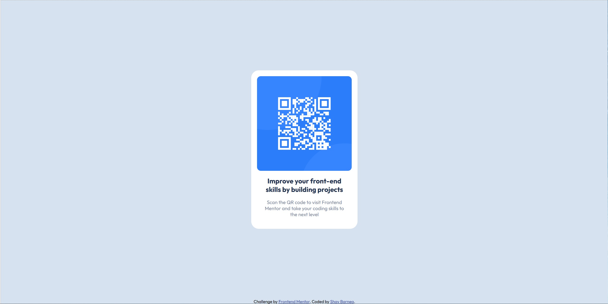

# Frontend Mentor - QR code component solution

This is a solution to the [QR code component challenge on Frontend Mentor](https://www.frontendmentor.io/challenges/qr-code-component-iux_sIO_H). Frontend Mentor challenges help you improve your coding skills by building realistic projects.

## Table of contents

- [Overview](#overview)
  - [Screenshot](#screenshot)
  - [Links](#links)
- [My process](#my-process)
  - [Built with](#built-with)
  - [What I learned](#what-i-learned)
  - [Continued development](#continued-development)
  - [Useful resources](#useful-resources)
- [Author](#author)
- [Acknowledgments](#acknowledgments)

## Overview

### Screenshot

  
_Desktop view_

  
_Mobile view_

### Links

- Solution URL: [qr-code-component](https://github.com/barshay/qr-code-componont)
- Live Site URL: [GitHub Pages](https://barshay.github.io/qr-code-componont/)

## My process

### Built with

- Semantic HTML5 markup
- CSS custom properties
- Flexbox

### What I learned

In this Challenge, I learned to work with flexbox. but, in most, I have learned to write markdown.
### Continued development

In the next steps, I want to continue focusing on flexbox.

### Useful resources

- [The Markdown Guide](https://www.markdownguide.org/) - This helped me for README.md.

## Author

- Frontend Mentor - [@barshay](https://www.frontendmentor.io/profile/barshay)